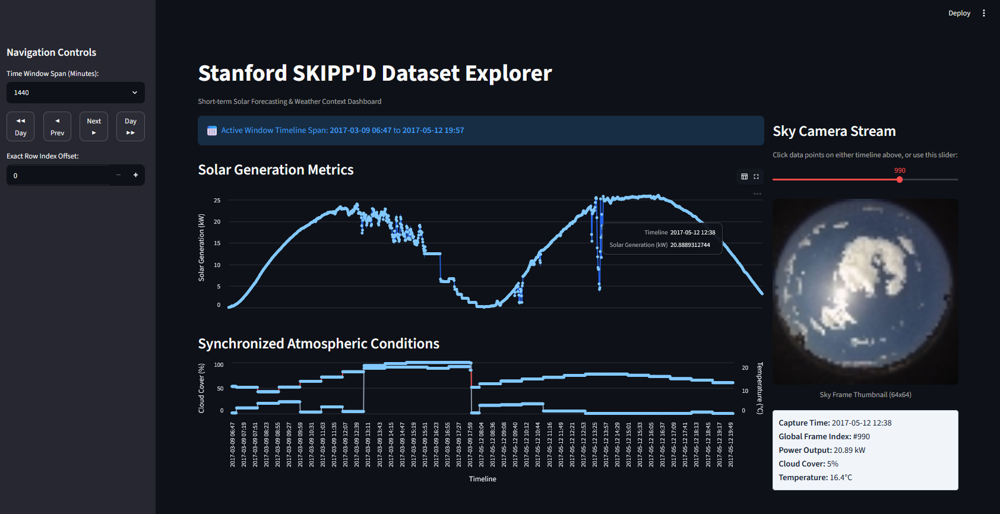
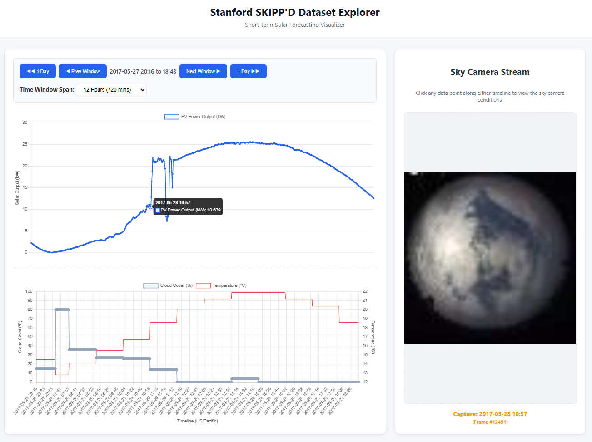

**PVdata** is a web app to visualize sky images and photovoltaic power generation in correlation to weather data.

# Used data
- **OpenMeteo**: weather data
  - https://open-meteo.com/
- **Stanford University**: 2019 Sky Images and Photovoltaic Power Generation Dataset for Short-term Solar Forecasting 
  - Nie, Y., Li, X., Scott, A., Sun, Y., Venugopal, V., and Brandt, A. (2022). *2017-2019 Sky Images and Photovoltaic Power Generation Dataset for Short-term Solar Forecasting (Stanford Benchmark)*. Stanford Digital Repository. Available at https://purl.stanford.edu/dj417rh1007
  - https://huggingface.co/datasets/solarbench/SKIPPD
  - https://searchworks.stanford.edu/view/dj417rh1007

# Finalized web app based on Streamlit (v2)

# Initial web app based on Flask (v1)
